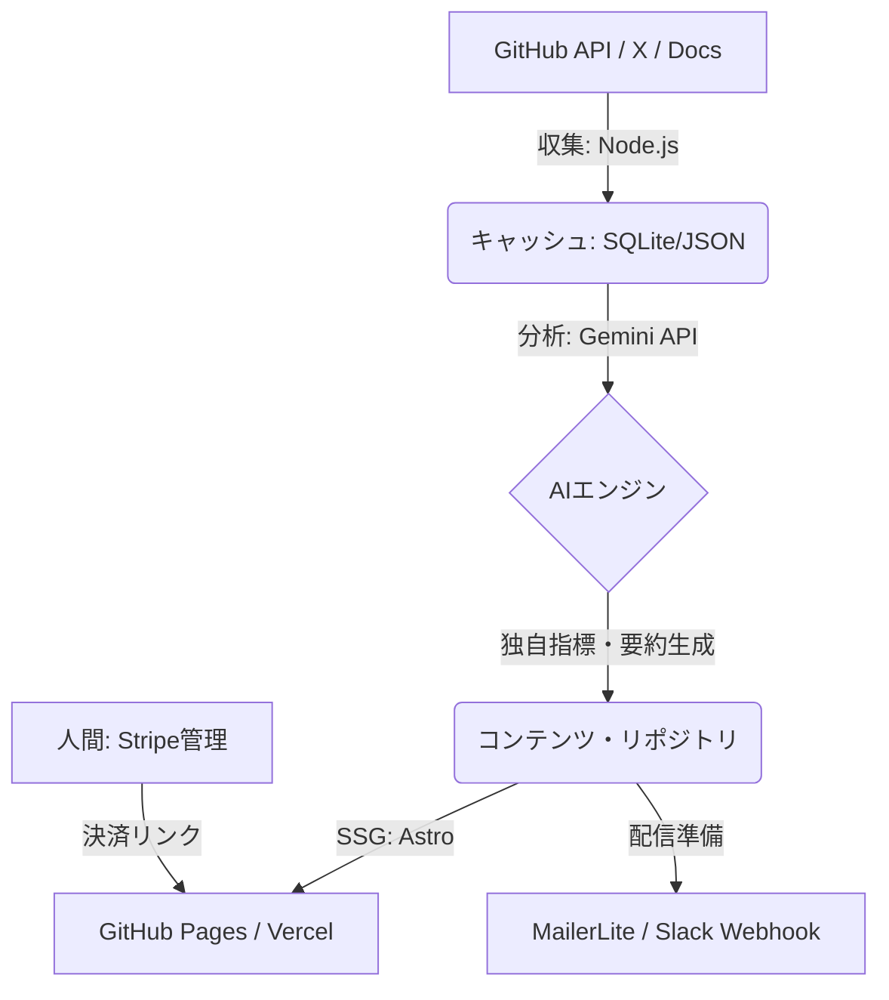

# システム設計書：MCP Insider 自動化システム

## 1. システム概要
低コスト（月間運用費 10ドル以下）かつ高自動化を実現するため、サーバーレスおよび静的サイト生成（SSG）を中心としたアーキテクチャを採用します。

## 2. アーキテクチャ図（データフロー）

## 3. コンポーネント詳細

### 3.1. データ収集エンジン（Collector）
- **技術スタック**: Node.js + Octokit (GitHub API) + Brave Search API
- **動作**: GitHub Actions のスケジュール実行（毎日）
- **役割**:
  - `model-context-protocol` タグの付いた新規リポジトリの取得
  - スター数の推移（トレンド）の記録
  - 最新ドキュメントの差分取得

### 3.2. AI 分析エンジン（Analyzer）
- **技術スタック**: Google Gemini 1.5 Flash（低コスト・高速）
- **役割**:
  - **トレンドスコア算出**: スター数、コミット頻度、開発者の信頼性を数値化。
  - **実装難易度判定**: `mcp.json` やソースコードの構造を解析し、3段階で評価。
  - **要約生成**: 開発者向け、ビジネス向けそれぞれの重要ポイントを抽出。

### 3.3. コンテンツ公開プラットフォーム（CMS & Web）
- **技術スタック**: Astro (SSG) + Tailwind CSS
- **ホスティング**: GitHub Pages (0ドル)
- **役割**:
  - 動的に生成された Markdown をベースに静的ページをビルド。
  - リードマグネット用フォーム（メールアドレス取得）の設置。
  - Stripe 決済リンク（Payment Links）の埋め込み。

### 3.4. 配信・通知システム（Distribution）
- **技術スタック**: GitHub Actions + MailerLite API (無料枠)
- **役割**:
  - 有料購読者向けニュースレターの自動配信。
  - Slack/Discord への速報通知データの生成。

## 4. コスト最適化戦略
- **キャッシュの活用**: 同一リポジトリの再分析を避け、Gemini API の呼び出し回数を最小化（月額 5ドル以下の予算枠を維持）。
- **無料枠の最大活用**: GitHub Actions, Vercel, MailerLite の無料枠を組み合わせることで、固定費をドメイン代のみに抑制。

## 5. リスク管理設計
- **ハルシネーション対策**: 生成されたコンテンツ内の URL 生存確認を自動化し、リンク切れや誤情報の記事公開を防止。
- **予算上限設定**: API キーごとに月間の利用上限を設定し、実質的なコストオーバーランを防止。

## 6. 次のステップ：実装項目
1.  **環境構築**: リポジトリ作成、GitHub ActionsSecrets 設定。
2.  **プロトタイプ作成**: 収集・分析エンジンの最小機能実装。
3.  **UI/UX 実装**: ランディングページとリードマグネット配布機能。
4.  **決済統合**: Stripe のテストモード連携。

---
